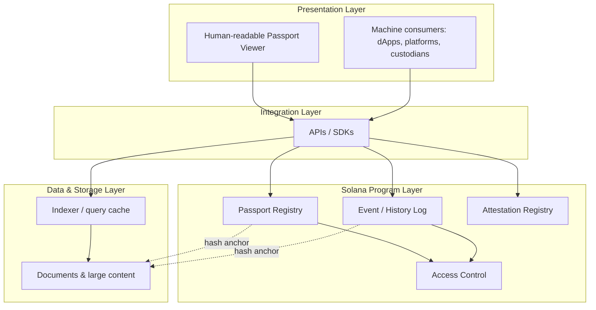

# System Architecture

Paxel is organized into four conceptual layers. This section describes *what each layer is responsible for*, not program code.

## 1. Data & Storage Layer

- **Offchain content store**: holds documents, extended metadata, and anything too large or too sensitive to put onchain.
- **Indexer**: a read optimized cache that mirrors onchain events so applications can query passports quickly without reading the chain directly for every request.

## 2. Solana Program Layer

- **Passport Registry**: the source of truth for "does this passport exist, who is its issuer, what is its current status."
- **Event / History Log**: the append only ledger of everything that has ever happened to a passport.
- **Access Control**: governs who is allowed to write what (issuer vs. verifier vs. admin/governance).
- **Attestation Registry**: where independent verifiers publish signed attestations about specific passport facts.

*(Full program responsibilities are detailed in* [*Solana Program Design*](program-design.md)*.)*

## 3. Integration Layer

- **APIs/SDKs** are the only way issuers and platforms are expected to interact with Paxel in practice: they wrap the onchain calls and offchain storage writes into a single, simple interface.
- This layer is what makes Paxel "boring to integrate": a platform doesn't need to understand program internals, just call `registerAsset()`, `addEvent()`, `getPassport()`, etc.

## 4. Presentation Layer

- **Human readable viewer**: a rendered "passport page" per asset, similar in spirit to a vehicle history report.
- **Machine consumers**: any application (RWA platform, lending protocol, insurer, wallet) that reads passport data programmatically via the API/SDK or directly from the chain/indexer.

## Design Principle: Home Chain + Portable Reference

A passport has one **home chain**, Solana, where its registry entry canonically lives, but its **hash anchored proofs** are designed to be portable: any chain or platform can verify a piece of passport data against the anchored hash without needing to trust Paxel's own infrastructure.
