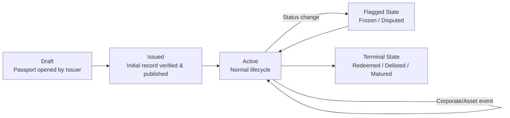

# Core Concepts

## The Passport

A **Passport** is the core primitive of Paxel: one passport per supported asset, created once and extended forever. It is never deleted and never fully overwritten, only **appended to**.

Conceptually, a passport is:

```
Passport = Identity + Ownership History + Transfer History + Valuation References
         + Documentation + Status History + Event History
```

Each of these is described in detail in [Data Model](data-model.md).

## Passport vs. Token

The passport is **not** the token itself: it is a linked record *about* the token (or about the asset, if the passport is opened before or independent of tokenization).

- One asset → one passport.
- One passport → one or more linked token references (a token can be rewrapped, bridged, or reminted across chains while the underlying asset, and its passport, stays the same).

## Append Only History

Paxel never deletes or silently edits history. Every change is a **new event** added to the passport's timeline:

- A correction to a past entry doesn't erase it: it adds a new event that references and supersedes the old one.
- This means a passport's timeline is always fully auditable: you can see not just the current state, but every state it ever passed through, and who asserted each change.

## Lifecycle



- **Draft**: issuer has opened a passport but it isn't yet verified/published.
- **Issued**: passport is live; minimum required fields are verified.
- **Active**: the normal operating state; the passport keeps accumulating events.
- **Flagged**: a status change (e.g. dispute, freeze) is recorded; the passport is still readable, just marked.
- **Terminal**: the asset's lifecycle has ended (redeemed, matured, delisted); the passport remains permanently readable as a historical record.

## Permanence

A passport is designed to outlive any single platform:

- Its canonical data lives in a place no single RWA platform controls.
- Even if the original issuer's platform disappears, the passport and its full history remain queryable.

## Dual Readability

Every passport has two equally valid forms:

- **Human readable**: a rendered view (e.g. a certificate style page) a person can read without technical tools.
- **Machine readable**: a structured object (JSON, following a published schema) any application can parse and validate.

Both forms are generated from the **same underlying record**: there is only one source of truth.
